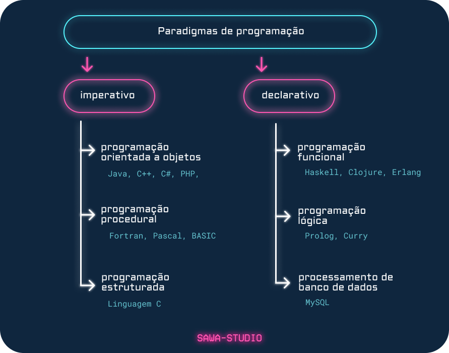
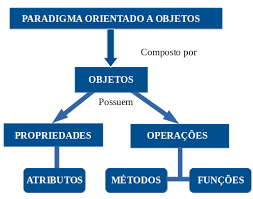

# Paradigma de Programação:

São "modelos" ou "regras". Grandes formas de como se deve estar desenvolvendo.

Exemplo: Progração orientada a objetos


## Abordagens
Podem ser "Imperativas" ou ""Declarativas"



### Paradigma Imperativo
Diz ao computador linha á linha oq deve ser feito. Coisa bem específica.

E.g.: Faça isso -> Faça isso - Faça isso -> até alcançar o resultado.

**Exemplos de Estilos de Programação Imperativas**
- **Programação Estruturada**
    - *"Programação Modular"*. Baseada em "if, else if, else" + loops e funções. 
    - Se define a estrutura de tomada de decisão.
- **Programação Procedural**
    - Divide o sistema em sub-rotinas (Métodos e funções). 
    - Divide os problemas em várias funções e aí vai chamando essas funções quando precisa delas.
    - Ajuda a reutilizar blocos de códigos no projeto.
- **Programação Orientada a Objetos**
    - Baseada na criação de objetos que possuem propriedads e métodos, permitindo o encapsulamento de dados e a reutilização de código. Em POO, todos os componentes do programa são representados como objetos.

### Paradigma Declarativo
Neste, se está mais preocupado com o resultado do que como ele é atingido. 
Mais focada no resultado.
Dá uma instrução á máquina e a máquina irá fazer o trabalho.

**Exemplos de Estilos de Programação Declarativos**
- **Programação Funcional**
    - Dada uma mesma entrada, sempre terá uma mesma saída. E não irá mudar o funcionamento do software em nível global. Funções puras e anonimas. () => {}. A idéia seria não usar laços for, por exemplo.

- **Programação Lógica**
    - Na programação lógica, vai se definir "fatos" e "regras" e todo o resto será inferido pela linguagem.
    - Se importa somente com o resultado.
    - Num `select * from tabela`, você não se importaria de como os resultados seriam buscados, o algoritmo de busca, etc. Você só quer os resultados.

> Exemplo:
```
Fato = Pai("Weber", "Roberto")

Teste: Pai("Weber", y) -> y = "Roberto"
Teste: Pai("Weber", "Isabela") ? = false 
```


---
## Programação Orientada a Objetos:



Útil para que humanos possam ler e entender código mais fácil.
Tornar código mais legível.

### Pilares 
- **Herança:** Criação de novos classes com base em classes existentes (permite que você compartilhe propriedades e métodos entre classes);
- **Polimorfismo:** permite que você trate objetos de classes diferentes de maneira uniforme, tornando seu código mais flexível e extensível;
- **Encapsulamento:** a ideia de que cada objeto deve manter a integridade de seus dados, garantindo que estes sejam acessados apenas por meio de métodos específicos da classe 
- **Abstração:** é a capacidade de ocultar detalhes irrelevantes ou complexos de um problema e focar nos aspectos essenciais.

### Benefícios:
- **Reutilização do Còdigo:** prevente a repetição de código que podria ser reutilizado.
- **Modularidade:** A POO incentiva a divisão do código em módulos independentes.
- **Flexibilidade e Escalabildiade:** uma classe de 9000 linhas não deve existir na POO. Deve ser quebrada em múltiplas classes e feita aí.
- **Organização e Coesão do Código**