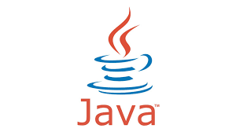

# O que seria um paradigma de programação?
Seriam algumas formas de programar, regras, princípios, como por exemplo, a programação orientada a objetos.
Tem relação com o estilo da formatação do código, e como ele deve ser escrito.

## Existem dois grandes tipos de abordagem

## paradigma imperativa

É necessário dizer linha a linha o que deverá ser feito no software, orienta o que deve ser feito, e como deve ser feito.
**Exemplos Imperativa**
### Programação estruturada:
também podendo ser chamada de programação modular, visa otimizar o código utilizando blocos de fluxo de controle de programa, e tomadas de decisão.
A principal intenção desse tipo de abordagem de programação é melhorar a legibilidade do código.
 ## paradigma declarativos

A preocupação é focada no resultado, não está focada no "como" e sim no "que".

### Funcional 
parte do principio que tudo são funções, existe uma sequência de funções matemáticas que juntas, resolverão o problema. 
  **Como exemplo: o JS**

### Lógica

A lógica define o que deve ser resolvido, enquanto o controle define como deve ser resolvido.
A vantagem é que o programador apenas precisa definir qual parte do problema quer resolver, e o sistema encontra a melhor solução. O fato é que possamos declarar novas regras e fatos, para encontrar novas soluções

---

## Programação Orientada a Objetos
Tem como objetivo encapsular daddos e a reutilização de código, todos os componentes são tratados como objetos.

### pilares
- herança : Criação de novas classes baseado em classes já existentes
- polimorfismo: trata-se da capacidade de um objeto se passar por outro compatível

### Benefícios
- Reutilização de código
- Modularidade: divisão de código em módulos
- Flexibilidade e escalabilidade: permite adicionar e modificar o comportamento dos objetos, sem afetar outras partes do sistema.
- Organização e coesão do código

## Java             
- multiparadigma
- procedural                               
- Estruturada
- POO 
- Programação concorrente 

