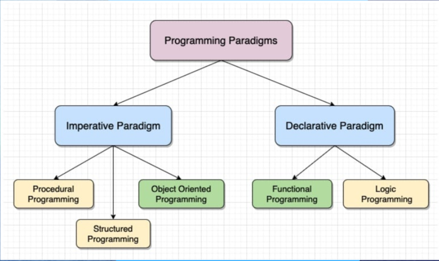

# Paradigmas de programação

Conjunto de regras que definem como o software será desenvolvido, define como modelar problemas complexos a serem resolvidos por meio de uma linguagem de programação.

---

### Programação Imperativa e Declarativa

Imperativa: Direcionar e comandar linha por linha sobre o que a máquina deve fazer (define o resultado). 

Declarativa: Preocupado com o resultado, sem focar no passo a passo.

---

### Paradigmas: 

Estruturada:
- If, else, for, while, etc 

- Primeiros modelos utilizados

Procedural:

- Dirige o sistema e o instrue com subrotinas e procedimentos

Orientada a objetos: 

- Traz conceitos abstratos para o código

- Divide o codigo em classes e objetos

---

### Pilates da POO:

- Herança

    - Classes em hierarquia.

>Ex: Classe pai passa atributos para a classe filha.

- Polimorfismo
    
    - Capacidade de um objeto se passar por outro, com métodos.

- Encapsulamento

    - Deixar classes específicas acessarem seus atributos.

- Abstração 

    - Representação de conceitos essenciais do mundo real.

---

### Benefícios:

- Reutilização de código: aproveitamento de classes e objetos já existentes

- Modularidade: Divide o codigo em modulos independentes

- Flexibilidade e escalabilidade no código

- Organização e coesão do código: Código desacoplado, o deixando compreensível.

---

### Paradigmas Declarativos:

Funcional: Preza por imutabilidade, utilizando constantes (variaveis imutaveis), funções puras e funções anônimas, todos os problemas buscam ser resolvidos com funções.

>Linguagens: Haskell, Scala, JS e Clojure.

Lógica: Define fatos e regras, e todo resto é infirito pela linguagem, muito utilizada em IA e SGBDs. 

>Exemplo SQL: Faz a busca no banco através de um comando, buscando apenas o interesse na informação final, não se preocupando com a forma que a informação será buscada.

>Linguagens: Prolog e Datalog

### Imagem explicativa sobre paradigmas imperativos e declarativos

### Java 

- Multiparadigma

- Procedural

- Estruturado

- POO

- Programação concorrente

- Funcional(a partir do java 8)

[Link explicativo sobre paradigmas de programação](https://prezi.com/view/8vuz05kE9S7HBczhRCyY/)